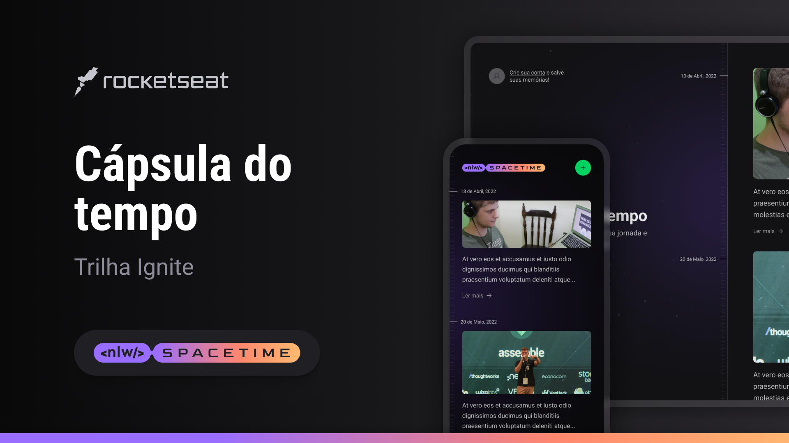

# Cápsula do Tempo (SpaceTime)

> Aplicação  full-stack, do back-end ao mobile, que funciona como uma cápsula do tempo guardando memórias passadas numa timeline. Utilizamos React, Tailwind, Node, Fastify, TypeScript, Expo, e Next.js.

Esse aplicação foi desenvolvida durante a NLW (Next Level Week).

## 📝 Licença

Esse projeto está sob licença. Veja o arquivo [LICENÇA](LICENSE.md) para mais detalhes.